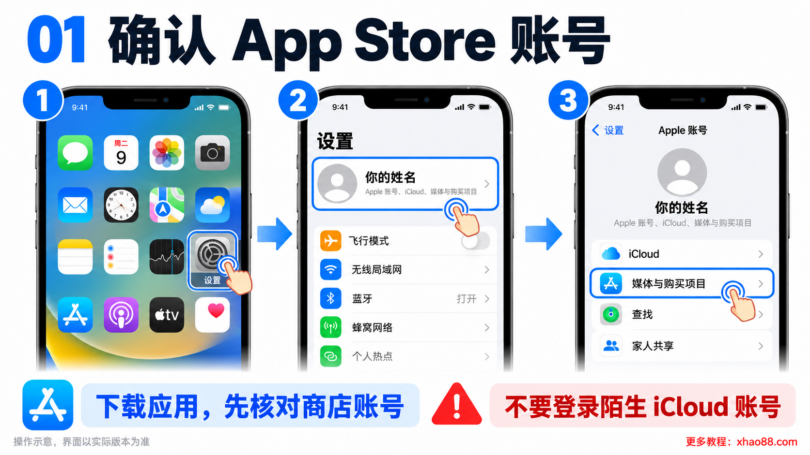
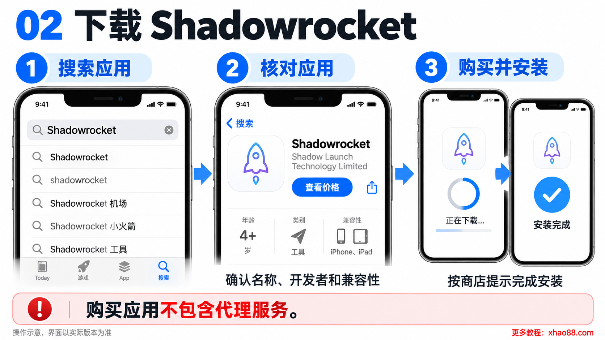
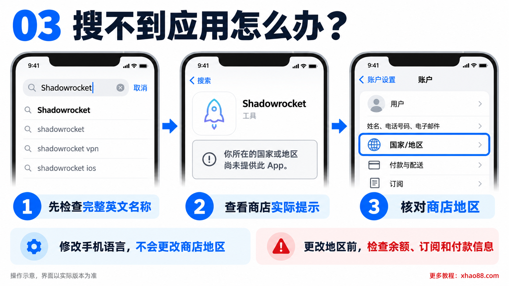
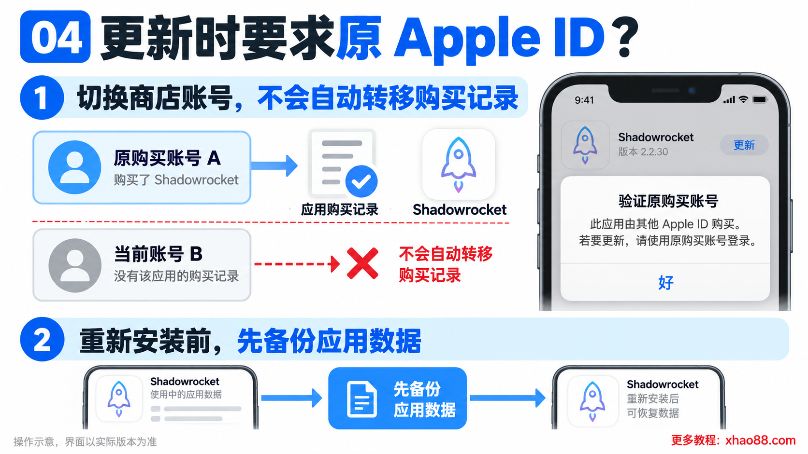
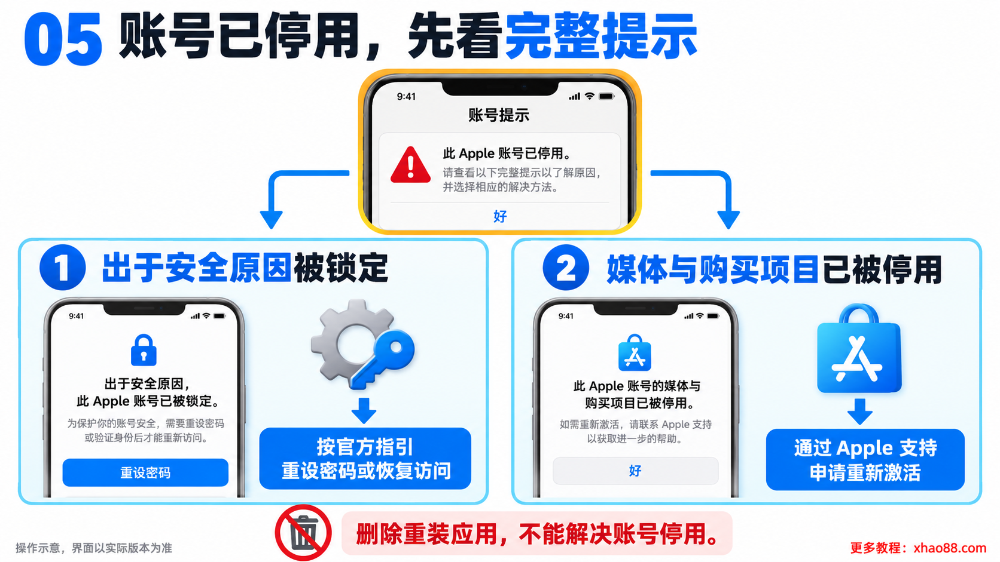
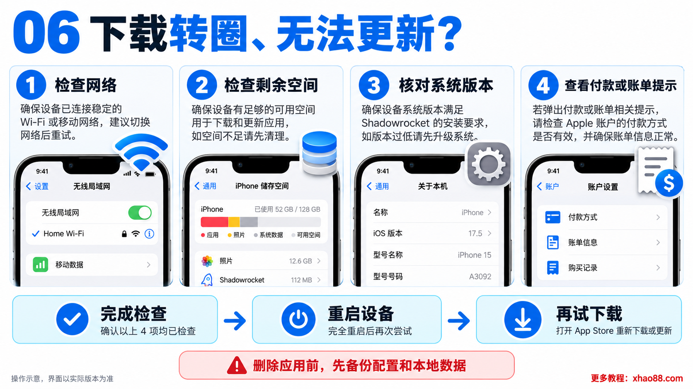
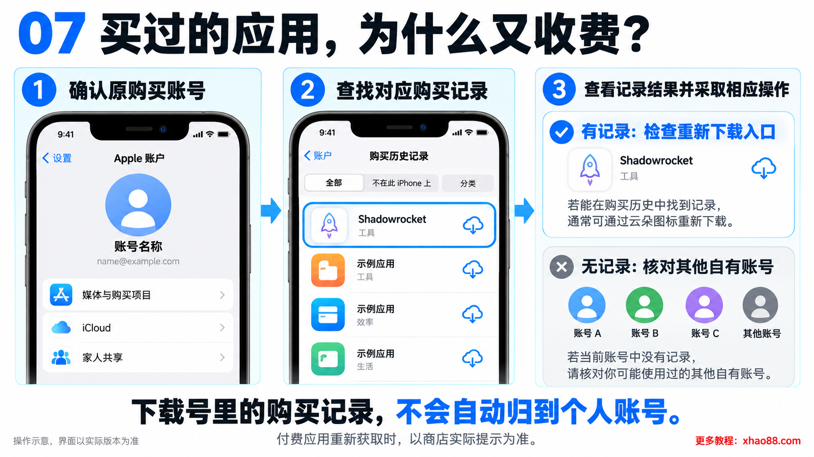

# 苹果ID下载号与苹果商店ID：Shadowrocket小火箭下载、更新问题汇总

苹果小火箭 Shadowrocket 怎么下载？为什么 App Store 搜不到？明明已经安装，更新时却要求输入另一个 Apple ID，甚至提示“账号已停用”？

这篇教程整理苹果商店账号、应用下载和更新时常见的问题，方便遇到报错时逐项排查。配图均为操作示意，具体界面和提示以设备实际显示为准。

## 一、苹果ID下载号、苹果商店ID是什么意思？

“苹果ID下载号”“苹果商店ID”是常见的民间叫法，通常指用于登录 App Store、下载或购买应用的 Apple 账户，并不是苹果单独推出的一种账号类型。

用于 iCloud 的账号和用于“媒体与购买项目”的账号可以不同。查看商店账号时，可以进入“设置 → 你的姓名 → 媒体与购买项目”。只需要处理应用下载时，不必退出整个手机的 iCloud 账号。[苹果账户说明](https://support.apple.com/zh-cn/117294)

建议使用自己长期掌握密码、验证方式和恢复信息的账号。不要把陌生或共享账号登录到 iCloud，也不要向他人提供自己的验证码。

## 二、苹果小火箭 Shadowrocket 怎么下载？

1. 在 iPhone 或 iPad 上打开 App Store，确认当前登录的是自己的商店账号。
2. 搜索完整英文名称 `Shadowrocket`，核对开发者为 `Shadow Launch Technology Limited`。
3. 查看应用价格、系统要求和兼容设备，确认后完成购买、下载安装。

也可以直接打开 [Shadowrocket 的 App Store 页面](https://apps.apple.com/us/app/shadowrocket/id932747118)。它是付费应用，实际价格和可用情况以当前商店显示为准。

Shadowrocket 本身是网络代理工具，购买应用不包含代理服务器或订阅服务。安装完成和具备可用连接配置是两回事，开发者在上述商店页面中也作了说明。

## 三、为什么 App Store 搜不到小火箭？

先确认搜索的是 `Shadowrocket`，再通过上面的商店链接查看提示。如果显示“你所在的国家或地区尚未提供此 App”，需要检查账号对应的商店地区及应用可用情况。

修改手机语言不会直接更改 App Store 账号地区。如果确实需要更改账号国家或地区，应按苹果要求处理余额、订阅和付款信息，操作前先查看[苹果更改国家或地区说明](https://support.apple.com/zh-cn/118283)。

## 四、为什么更新时要求原来的 Apple ID？

如果应用最初由另一个 Apple 账户下载或购买，更新时可能要求验证那个账号。仅切换当前商店账号，不会自动把原账号的购买记录转到新账号。[苹果登录与更新说明](https://support.apple.com/zh-cn/111001)

先核对弹窗中的账号是否属于自己。若无法继续使用原账号，可以考虑通过自己的账号重新获取应用；付费应用可能需要重新购买。删除前先导出或备份应用配置，并确认当前商店仍能下载，避免删掉后无法装回。

## 五、显示“该账号已停用”，怎么处理？

要看完整提示。若写着“出于安全原因被停用”或账号被锁定，按照苹果页面指引重设密码或申请恢复访问。[账号锁定处理说明](https://support.apple.com/zh-cn/102640)

若明确提示“你的‘媒体与购买项目’账户已被停用”，应通过 Apple 支持申请重新激活。反复删除、重装应用不能解决这类账号问题。[申请重新激活](https://support.apple.com/zh-cn/108100)

## 六、下载一直转圈、无法更新怎么办？

先检查网络连接、设备剩余空间以及应用要求的系统版本，再尝试重启设备、重新下载。若出现“需要验证”或账单问题，检查付款方式和未结清的购买项目；即使下载免费应用，也可能需要有效的付款信息。[苹果下载与更新排查说明](https://support.apple.com/zh-cn/102632)

不要一遇到更新失败就删除应用。尤其是保存了配置、文件或本地数据的应用，应先做好备份。

## 七、买过的应用为什么又显示收费？

先确认登录的是原购买账号，并查看购买历史记录。若当前账号没有这笔购买记录，可能当初使用了其他账号。符合条件的家庭共享购买项目，也应从对应的共享入口查找。[苹果重新下载说明](https://support.apple.com/zh-cn/108105)

“下载号里有这个应用”不等于购买记录已经归到你的个人账号。长期使用的付费应用，建议保留自己的购买记录，后续更新和重新安装会更方便。

更多教程与网站入口：[xhao88.com](https://xhao88.com/)
